#  Дипломная работа по профессии «Системный администратор»

Содержание
==========
* [Задача](#задача)
* [Инфраструктура](#инфраструктура)
    * [Сайт](#сайт)
    * [Логи](#логи)
    * [Мониторинг](#мониторинг)
    * [Сеть](#сеть)
    * [Резервное копирование](#резервное-копирование)

---------
## Задача
Ключевая задача — разработать отказоустойчивую инфраструктуру для сайта, включающую мониторинг, сбор логов и резервное копирование основных данных. Инфраструктура должна размещаться в [Yandex Cloud](https://cloud.yandex.com/).

## Инфраструктура
Для развёртки инфраструктуры используем [Terraform](./terraform), а для установки ПО [Ansible](./ansible).

Terraform:

Выполняю проверку синтаксиса конфигурационных файлов командой `terraform validate`

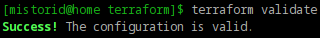

Просматриваю план развёртывания инфраструктуры командой `terraform plan`

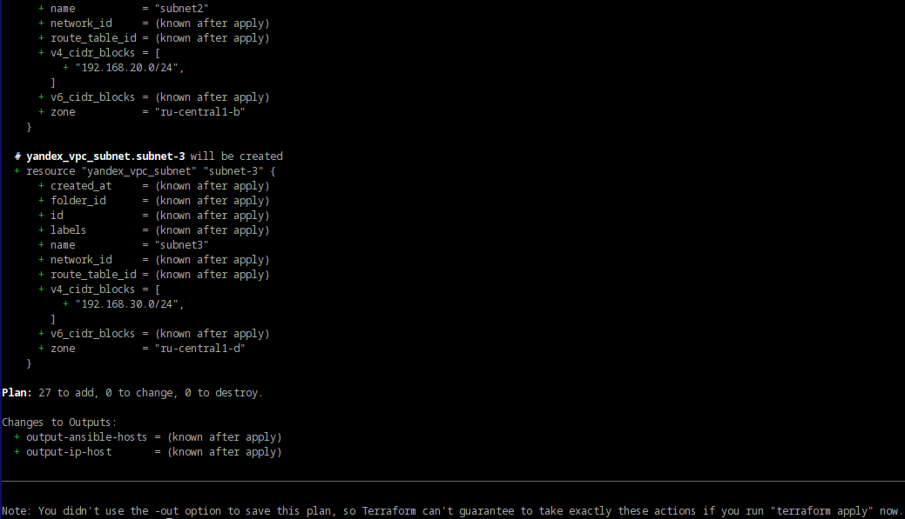

Запускаю создание инфраструктуры командой `terraform apply`

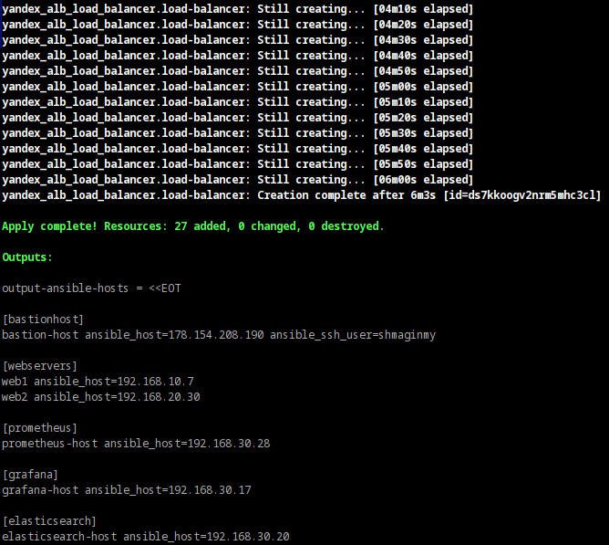

После завершения работы Terraform получаю итоговый вывод с адресами всех созданных ресурсов

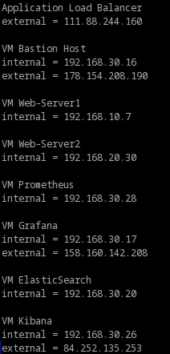

Сохраняю заранее подготовленный [output с хостами](./terraform/output.tf) в файл `hosts` для Ansible, привожу его к нужному формату

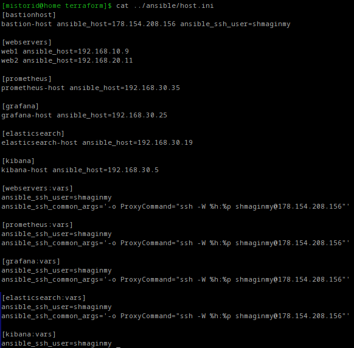

Проверяю доступность всех созданных ВМ командой `ansible all -m ping`

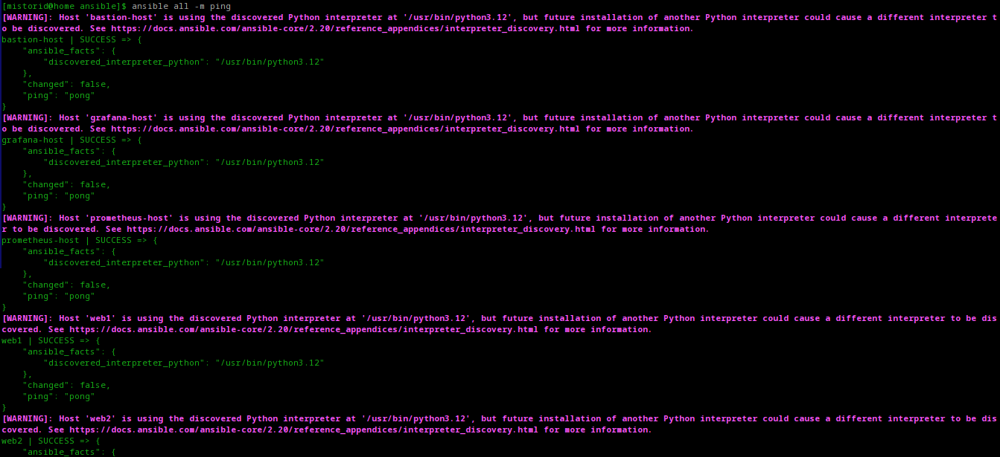

Далее перехожу к установке и настройке программного обеспечения с помощью Ansible.

### Сайт

Для настройки веб-серверов запускаю playbook — [webservers-playbook.yml](./ansible/webservers-playbook.yml)

После успешного выполнения убеждаюсь, что сервисы `nginx`, `node_exporter` и `nginx_logexporter` запущены и работают

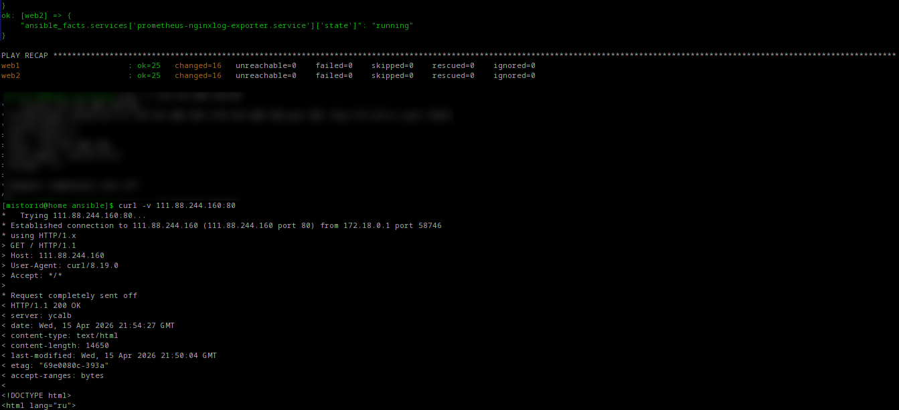

Проверяю доступность сайта через Application Load Balancer

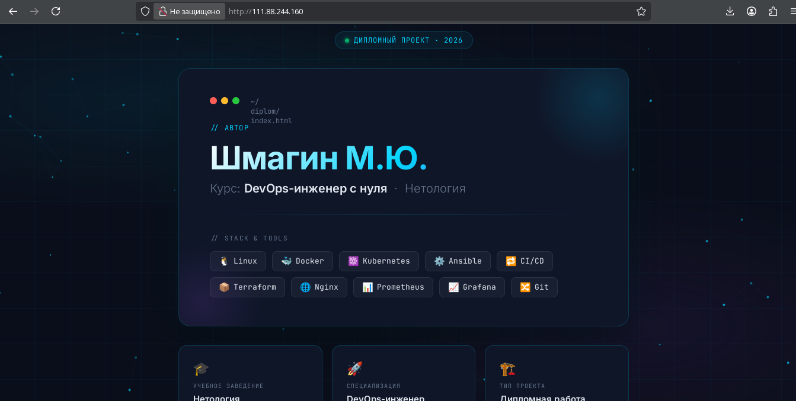

### Логи

Для развёртки стека логирования запускаю playbook — [log-playbook.yml](./ansible/log-playbook.yml)

По завершении убеждаюсь, что контейнеры с `Elasticsearch` и `Kibana` успешно запущены

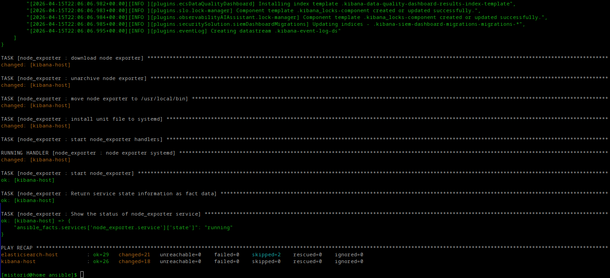

Устанавливаю `Filebeat` на веб-серверы с помощью — [log-filebeat-playbook.yml](./ansible/log-filebeat-playbook.yml)

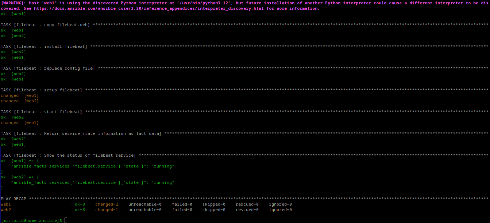

Открываю интерфейс Kibana и убеждаюсь, что логи `nginx` с обоих веб-серверов поступают корректно

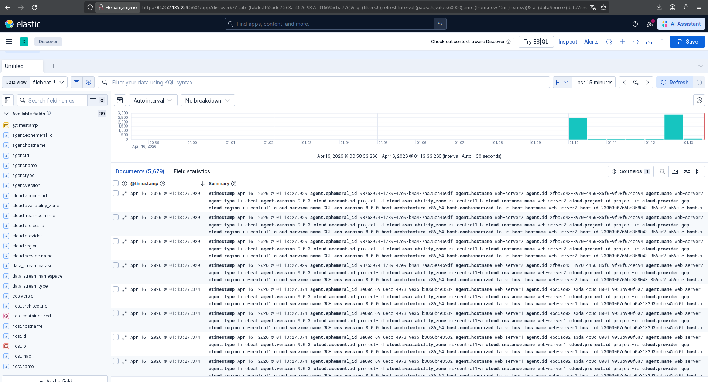

### Мониторинг

Для настройки мониторинга запускаю playbook — [monitoring-playbook.yml](./ansible/monitoring-playbook.yml)

Убеждаюсь, что выполнение playbook завершилось без ошибок

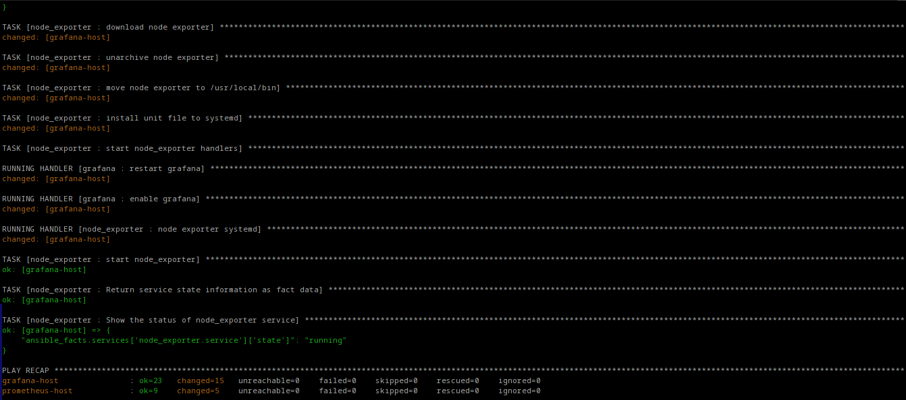

Открываю Grafana и проверяю работу импортированных дашбордов.

Дашборд **NGINX Servers Metrics** — метрики веб-серверов:

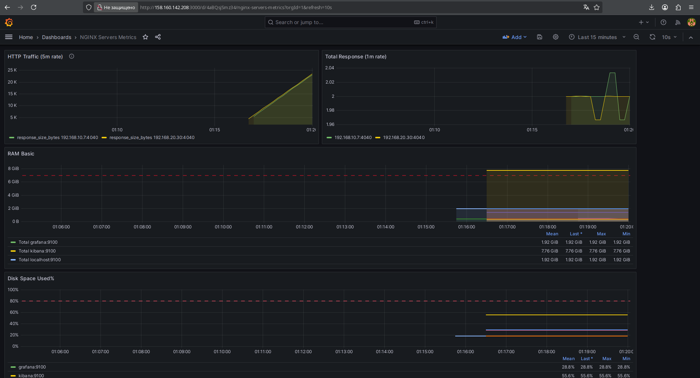

Дашборд **Node Exporter Full** — системные метрики (CPU, RAM, диск, сеть):

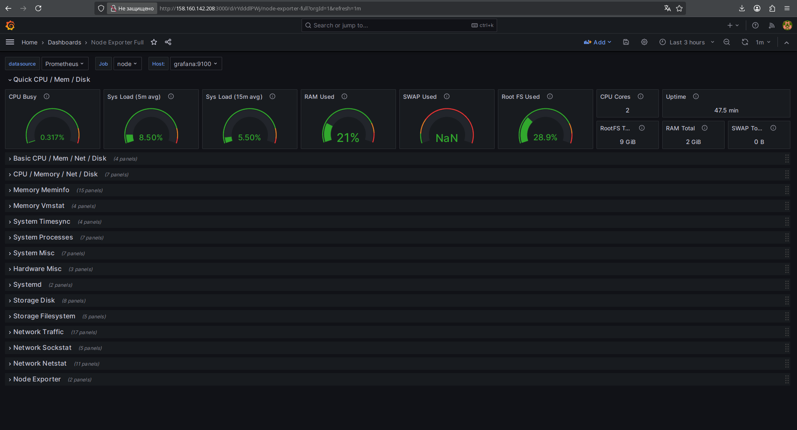

### Сеть

Топология сети: VPC, подсети, распределение ВМ по зонам доступности

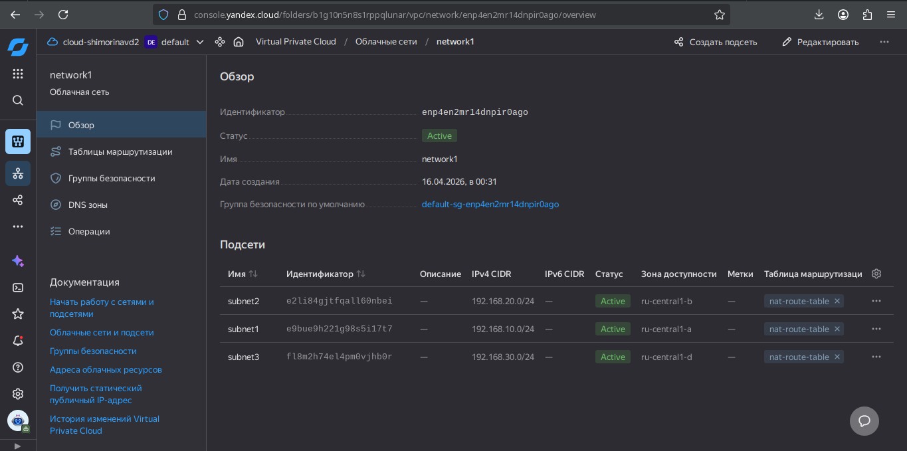

Настроенные группы безопасности с правилами входящего и исходящего трафика

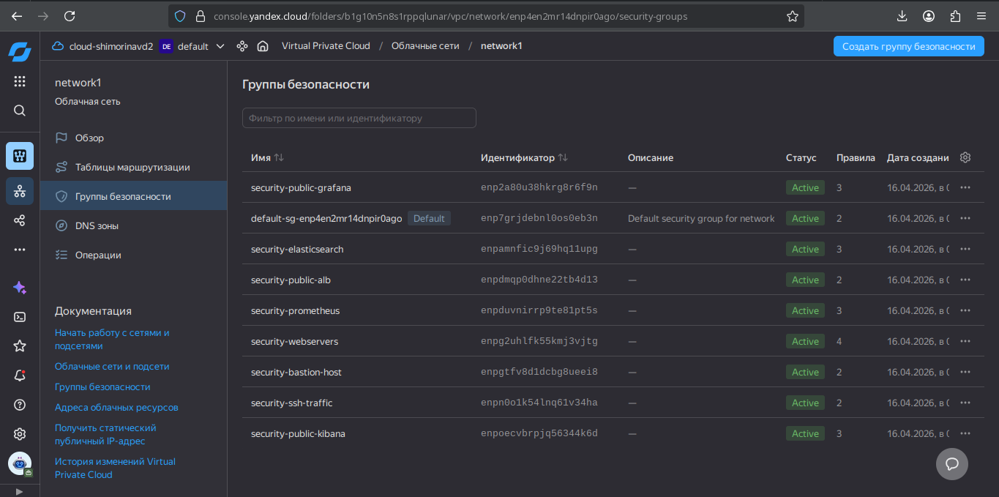

Bastion-хост для безопасного SSH-доступа во внутреннюю сеть

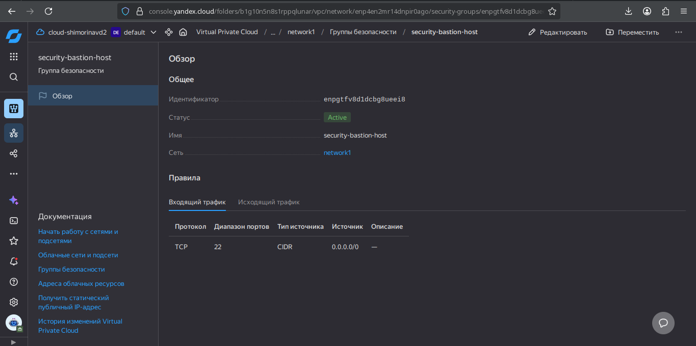

### Резервное копирование

Настроено автоматическое ежедневное создание снапшотов всех дисков с периодом хранения 7 дней

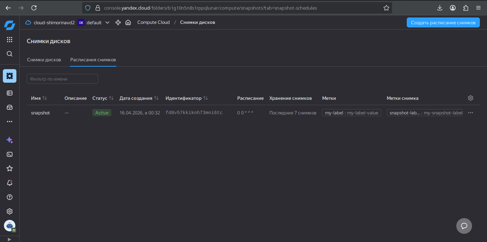

